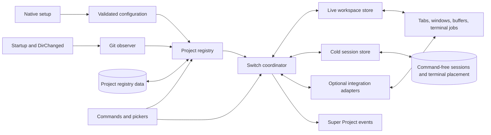

# Design: Create the Super Project Neovim plugin

| Created | Updated |
| --- | --- |
| 2026-09-17 | 2026-09-18 |

## Context

This repository has no implementation or prior specifications. The capability
reference is [`coffebar/neovim-project`](https://github.com/coffebar/neovim-project)
`main` at commit `f4e9b3392dc46b6e615b629a40ea4fa47cc2a203`
(2026-05-01).

The reference plugin delegates persistence to
`Shatur/neovim-session-manager`. Its load path force-deletes every buffer
before sourcing a session, and its save path deletes buffers it considers
non-restorable. Native Neovim sessions can serialize terminal URI entries,
which starts a new terminal command when sourced. Those behaviors conflict
with preserving an already-running job.

Neovim itself provides the needed same-process primitive: an active terminal
job continues running while its terminal buffer is hidden, provided the buffer
is not unloaded or wiped. Super Project will therefore separate **hot workspace
restoration** (live buffers retained in memory) from **cold session
restoration** (command-free terminal placement persisted to disk).

## Capability parity and native surface

Super Project uses the reference plugin as a capability inventory, not an API
contract. Users moving to Super Project will update their setup, command names,
and picker integrations.

| Reference capability | Super Project counterpart |
| --- | --- |
| Configured path/glob discovery | Native discovery roots |
| Ignored projects | Native discovery exclusions applied to every source |
| Recent history and forgetting | Persistent project registry with recency and removal |
| Saved project sessions | Command-free cold terminal placeholders plus exact live workspaces |
| Current/last project startup | Native startup policy with Git roots recognized automatically |
| Per-branch sessions | Project- or branch-scoped workspace keys |
| Telescope, fzf-lua, Snacks, builtin picker | Provider adapters over one native picker model |
| Preview tree and Git status | Native optional project details pane |
| neo-tree expansion and barbar ordering | Native session payload hooks for equivalent restoration |
| Super Tree workspace and Projects pane | Native state adapter and project-provider integration |
| Debug log | Native logging levels and diagnostics |

Super Project intentionally does **not** expose
`require("neovim-project")`, `NeovimProject...` commands, the
`neovim-project` Telescope extension, legacy `User` event names, or legacy
configuration keys. It stores state under its own data directory and does not
implicitly read or rewrite the reference plugin's data.

Session Manager is not a runtime dependency and Super Project does not alter a
separately configured Session Manager installation. Migration documentation
will tell users to remove or independently configure that dependency so two
session engines do not compete for startup and exit behavior.

### Native configuration

The setup table groups behavior by concern rather than mirroring the reference
plugin's flat option names:

```lua
require("super-project").setup({
  discovery = {
    roots = {},
    excludes = {},
    observe_git_cwd = true,
    symlinks = "resolve", -- "resolve", "prefix", or "preserve"
  },
  storage = {
    directory = vim.fn.stdpath("data") .. "/super-project",
  },
  startup = {
    fallback = "last", -- "last" or "empty"
    defer_when_dashboard = false,
  },
  sessions = {
    scope = "project", -- "project" or "branch"
    filetype_delay_ms = 200,
    exclude = {
      directories = {},
      filetypes = {},
      buftypes = {},
    },
  },
  terminals = {
    keep_alive = true,
  },
  integrations = {
    neo_tree = true,
    super_tree = true,
    barbar = true,
  },
  selector = {
    backend = "builtin", -- "builtin", "telescope", "fzf-lua", or "snacks"
    forget_bindings = { insert = "<C-d>", normal = "d" },
    display = {
      project_details = true,
      git_state = true,
      fetch_remote = false,
      hidden_entries = true,
    },
    backend_options = {},
  },
  logging = {
    level = "warn", -- "off", "error", "warn", "info", or "debug"
  },
})
```

The migration guide will map capabilities rather than accept old keys:

| Reference option | Super Project setting |
| --- | --- |
| `projects` | `discovery.roots` |
| `ignore_projects` | `discovery.excludes` |
| `datapath` | `storage.directory` |
| `last_session_on_startup` | `startup.fallback` |
| `dashboard_mode` | `startup.defer_when_dashboard` |
| `filetype_autocmd_timeout` | `sessions.filetype_delay_ms` |
| `follow_symlinks` | `discovery.symlinks` with translated enum values |
| `per_branch_sessions` | `sessions.scope` |
| `session_manager_opts.autosave_ignore_*` | `sessions.exclude.*` |
| `forget_project_keys` | `selector.forget_bindings` |
| `picker.type` | `selector.backend` |
| `picker.preview` | `selector.display` |
| `picker.opts` | `selector.backend_options` |
| `debug_logging` | `logging.level = "debug"` |

### Native commands, pickers, and events

The command surface provides the reference capabilities under concise native
names:

- `:SuperProjectFind [source|recent|name|path]` opens all accepted projects
  with the requested ordering.
- `:SuperProjectRecent` opens the recent-project selector.
- `:SuperProjectOpen [directory]` registers and opens any existing accepted
  directory. With no argument, it opens a hierarchical `vim.ui.select`
  browser at the effective CWD; users choose child/parent entries to navigate
  and the leading `Open this directory` entry to activate the current level.
- `:SuperProjectPrevious [count]` returns to a prior project by recency.
- `:SuperProjectForget [path]` removes registry and cold-session state after
  confirmation without terminating live jobs.

The Telescope extension is named `super-project` and exports `find` and
`recent`. fzf-lua, Snacks, and builtin selection invoke the same source and
actions rather than exposing separate semantics.

Lifecycle integrations use the `User` patterns `SuperProjectSwitchPre/Post`,
`SuperProjectSavePre/Post`, and `SuperProjectLoadPre/Post`. Event data includes
the source and target workspace keys where applicable. No legacy event aliases
are emitted. `SuperProjectRegistryChanged` tells views such as the Super Tree
Projects pane to refresh after discovery, recency, or removal changes.

The Lua surface also provides `projects(opts)`, `current()`, `open(root)`, and
`browse(start_directory)` for native consumers. `open(root)` applies the same
manual registration and exclusion checks as the command. Super Tree uses these
methods rather than reaching into registry or switch-coordinator internals.

### Dependency policy

Dependencies belong to the user's plugin-manager specification; the native
setup table only selects behavior. This keeps configuration declarative and
does not make Super Project responsible for installing or loading other
plugins.

| Dependency | Requirement |
| --- | --- |
| Neovim 0.10+ | Required |
| Git executable | Required for observed-CWD Git discovery and branch-scoped sessions; otherwise optional |
| Telescope | Optional when `selector.backend = "telescope"` |
| fzf-lua | Optional when `selector.backend = "fzf-lua"` |
| Snacks | Optional when `selector.backend = "snacks"` |
| neo-tree | Optional feature-detected payload integration |
| Super Tree | Optional workspace-state and Projects-pane integration |
| barbar | Optional feature-detected payload integration |
| Plenary | Not required |
| Neovim Session Manager | Not required |

Installation documentation will show separate plugin-manager examples for the
builtin selector, each external selector, and optional UI integrations. The
`integrations` table enables adapters but does not install those plugins. If a
configured external selector is unavailable, Super Project warns once and uses
the builtin selector. If Git is unavailable, configured roots and
project-scoped sessions continue to work; observed-CWD discovery is skipped
with one warning. Branch scope without Git is a configuration error because
silently changing session identity could restore the wrong workspace.

## Architecture

The registry decides which roots exist; the switch coordinator is the only
component allowed to change the active workspace. Hot state and cold state
are deliberately separate so no persisted artifact can rerun a prior terminal
command or claim its process survived.



### Components

- **Configuration** deep-merges native defaults, validates option types and
  enum values, and owns feature gates.
- **Project registry** unions configured glob results, persisted recent
  projects, and Git-observed roots, then applies one canonical exclusion and
  deduplication pipeline.
- **Git observer** performs argument-vector Git calls without a shell. Startup
  detection may wait briefly because it determines autoload behavior;
  directory-change detection is asynchronous, debounced, and generation
  guarded.
- **Registry store** persists canonical and display paths, source metadata, and
  recency in a versioned native format. Writes use a same-directory temporary
  file and atomic rename. An fs watcher invalidates cached state when another
  Neovim process updates it.
- **Switch coordinator** serializes project transitions, owns rollback, emits
  events, and suppresses recursive reactions to its own CWD changes.
- **Live workspace store** keeps runtime-only buffer IDs, terminal job IDs,
  tab/split layout, and views. It never serializes terminal commands.
- **Cold session store** writes and loads plugin-owned Neovim sessions while
  replacing visible terminals with inert named layout placeholders and
  excluding unrelated hidden buffers.
- **Integration adapters** suspend plugin-owned windows before generic layout
  capture, serialize supported state, and restore through each plugin's public
  API without eagerly loading optional dependencies.
- **Picker adapters** share one source and action model so filtering, sorting,
  selection, preview, and forgetting do not diverge by provider.

## Project identity and discovery

### Canonical identity

The internal project key is a normalized absolute real path. The registry also
retains a display path so a configured symlink or `~` spelling can be shown to
the user. Canonical identity prevents one repository from appearing multiple
times because it was reached through a symlink, path separator variation, or
subdirectory.

When Git discovery is enabled, the observer runs the equivalent of:

```text
git -C <effective-cwd> rev-parse --show-toplevel
```

The command is passed as an argument vector, not shell text. Its normalized
top-level result is the candidate. This correctly identifies linked Git
worktrees, whose `.git` entry is a file, and ensures a CWD below the root does
not become an accidental nested project. Bare repositories do not produce a
worktree root and are not auto-registered.

### Candidate pipeline

Every source uses the same pipeline:

1. Expand `~`, environment variables supported by Neovim, and configured
   globs.
2. Reject missing or non-directory paths.
3. Compute canonical and display paths according to `discovery.symlinks`.
4. Match `discovery.excludes` against normalized display and canonical paths.
5. Deduplicate by canonical path.
6. Record accepted Git observations in recent history.

Exclusion rules have final precedence, including over persisted registry data
and direct command arguments. An excluded stored path remains harmless on disk
until the next registry rewrite, at which point it is pruned.

Configured glob expansion remains lazy until discovery or startup matching is
needed. Git observation does not recursively scan parent collections. Each
asynchronous directory-change request captures a monotonically increasing
generation; its callback is discarded if a newer CWD event has occurred.

## Workspace model

The live store is keyed by canonical root and, when enabled, branch identity.
It holds only process-local references:

```text
Workspace
  key, root, branch, active_tab_index
  tabs[]
    local_cwd, active_window_index, split_tree
    windows[]
      buffer_id, cursor, view, local_options
  buffers[]
    buffer_id, owner_key, original_bufhidden, original_buflisted, kind
  terminals[]
    buffer_id, terminal_job_id, last_window_location
  integrations{}
    adapter_name -> serializable plugin state
```

`winlayout()` supplies each tab's row/column split tree. Floating windows are
not part of that tree and are outside the continuity guarantee. Views use
`winsaveview()`/`winrestview()`. A buffer referenced by multiple windows is
protected once and reused in every restored leaf.

`TermOpen` associates a terminal buffer with the active workspace. `TermClose`
updates its running status. Hot restoration reuses a captured terminal only
while its job is still running; otherwise its saved leaf receives a fresh
default terminal. Hidden terminals created by terminal plugins remain
associated even when they were not visible at switch time, but only terminals
represented by a captured window are automatically reopened.

Before the last window showing any captured buffer is closed, the coordinator
records its original `bufhidden` value and temporarily sets it to `hide`. This
protects terminal jobs and modified regular buffers even when another plugin
normally uses `wipe`, `delete`, or `unload`. The original value is restored
after the buffer is visible again. Explicit `bdelete`/`bwipeout` by the user or
another plugin remains authoritative and is not intercepted.

The coordinator also records `buflisted` and clears it while a workspace is
parked. This keeps the buffers loaded for exact hot restoration while removing
them from bufferline-style UIs, which conventionally enumerate listed buffers.
Restoration reapplies each buffer's prior listed state. Buffers under the
project root and normal, acwrite, or terminal buffers entered while that
workspace is active receive an in-process owner key so hidden buffers are
isolated along with visible layout leaves.

The transition tab and each `tabnew` seed used to reconstruct a split tree are
explicitly marked temporary, unlisted before they can enter a bufferline, and
wiped after their windows receive saved buffers. A clean unnamed buffer used
as a genuinely new workspace is instead marked as that workspace's placeholder
and removed only after it becomes hidden and unused. Repeated hot switches
therefore do not accumulate `[No Name]` buffers.

## Explorer and UI integrations

### Adapter lifecycle

Optional integrations implement a common lifecycle:

1. **Capture** serializable project-specific state while the plugin UI is
   still valid.
2. **Suspend** plugin-owned windows through the plugin's public close API so
   nofile buffers and stale window IDs enter the generic workspace snapshot.
3. **Restore** the generic workspace and effective CWD first, then reapply the
   plugin state through its public API.
4. **Persist** the same state in the cold-session sidecar, excluding runtime
   window and buffer IDs.

Adapters inspect `package.loaded` and plugin events rather than requiring an
optional dependency during setup. On a cold restore, a saved `open` state may
demand-load its enabled explorer through the normal module loader; closed or
absent state never triggers a load. If an integration loads after its
workspace, pending state is applied when that plugin becomes available. An
adapter failure is reported and isolated; it does not fail the underlying
project switch.

Stored paths are canonicalized and represented relative to the project root
when possible. Restoration ignores missing paths and rejects paths that escape
the project root.

### neo-tree

The neo-tree adapter captures whether the filesystem source is open, its
expanded directories, selected path, and relevant view dimensions. It closes
the source before generic layout capture and restores it after the target CWD
is active. The adapter uses neo-tree's public manager/command interfaces and
does not load neo-tree during setup; absent installations remain a no-op.

### Super Tree

The inspected `super-tree.nvim` interface currently exposes `open`, `close`,
`is_open`, and `reveal`, while expansion and pane state live in internal module
tables. Its Projects pane also imports `neovim-project` internals directly.
Depending on those internals from Super Project would be brittle and would
reintroduce the legacy aliases this proposal intentionally excludes.

The companion work in `../super-tree.nvim` will therefore add these stable
public hooks:

- `capture_state()` returns a versioned plain Lua table containing the tree
  root, open state, expanded paths, selected path, hidden-entry state, Buffers
  and Projects pane visibility, pane cursor selections, sidebar width, and pane
  heights.
- `restore_state(state)` validates that table and rebuilds the UI through Super
  Tree's own window and rendering functions. Search/filter text remains
  transient and is intentionally cleared.
- `register_project_provider(name, provider)` accepts a provider with
  `projects(opts)`, `current()`, and `open(root)` callbacks. An explicitly
  registered provider takes precedence over Super Tree's existing optional
  `neovim-project` fallback.

Super Project registers that provider after both plugins are loaded. The Super
Tree Projects pane then consumes canonical/display paths and recency from the
public Super Project API, invokes the switch coordinator through `open(root)`,
and refreshes on `SuperProjectRegistryChanged` and
`SuperProjectSwitchPost`. No compatibility module is injected into
`package.loaded`.

The Super Project adapter calls `capture_state()` before parking, calls
`close()` during suspension, and calls `restore_state()` after the target
workspace and CWD are ready. This preserves Super Tree's project-specific UI
without retaining invalid plugin window IDs in a parked workspace.

Super Tree distinguishes an existing non-plugin window from a window suitable
for opening a file. Terminal windows satisfy its "do not leave only the tree"
layout guard, but remain excluded as file-replacement targets. Deleting the
last normal file buffer therefore does not create a new split when terminal
windows already remain beside the tree.

### barbar

The barbar adapter captures project-visible buffer ordering before parking and
restores that ordering after the workspace buffers and tabs exist. It remains
a no-op when barbar is not loaded and does not own or delete buffers.

## Switch transaction

A disposable transition tab gives Neovim a valid current window while all
managed tabs for project A are parked. No tabs from background projects remain
visible, but their buffers and jobs stay loaded.

```mermaid
sequenceDiagram
  actor User
  participant S as Switch coordinator
  participant A as Active workspace A
  participant D as Cold session store
  participant I as Integration adapters
  participant N as Neovim runtime
  participant B as Target workspace B

  User->>S: Select project B
  S->>S: Validate target and acquire switch guard
  S->>I: Capture and suspend A plugin state
  S->>A: Capture tabs, split trees, views, and buffer IDs
  S->>D: Save cold session and integration sidecar for A
  S->>N: Protect buffers and park A behind transition tab
  alt B has a live snapshot
    S->>B: Rebuild layout using surviving buffer IDs
    B->>N: Reattach running terminals; reopen missing jobs
  else B has only a cold session
    S->>D: Load safe session and terminal placeholders
    D->>N: Open fresh default terminals in saved leaves
  else B is new
    S->>N: Create a clean workspace rooted at B
  end
  S->>N: Set CWD and active project
  S->>I: Restore B plugin state
  S->>S: Commit history and emit post events
  S-->>User: Project B is active
```

The transaction order is:

1. Normalize and validate B, including exclusion checks, before mutating A.
2. Emit `SuperProjectSwitchPre`.
3. Emit `SuperProjectSavePre`, then capture and suspend A's optional
   integrations through their adapters.
4. Capture A's generic live state, write its cold session and integration
   sidecar, then emit `SuperProjectSavePost`.
5. Create the transition tab, protect A's buffers, and close A's managed tabs.
6. Emit `SuperProjectLoadPre`, then restore B from a live snapshot, a cold
   session, or a new empty workspace.
7. Set the effective CWD, active key, history recency, and branch watcher;
   restore B's optional integrations; then emit `SuperProjectLoadPost`.
8. Emit `SuperProjectSwitchPost` and release the guard.

If steps 3–7 fail, the coordinator removes any partial target layout and
rebuilds A from the just-captured live snapshot, then asks each successfully
captured adapter to restore A's plugin state. Protected buffers are not deleted
during rollback. If individual buffers were explicitly deleted during the
transition, their leaves receive a normal scratch buffer and the failure is
reported without abandoning the rest of the workspace.

Plugin-initiated CWD changes carry a suppression flag. External `:cd`, `:tcd`,
or `:lcd` changes are observed for Git registration but do not silently replace
the active workspace; project activation remains an explicit startup or switch
operation.

## Terminal lifecycle

Running terminal state is intentionally memory-only:

- A terminal's buffer ID and `b:terminal_job_id` are captured before parking.
- Closing its window while `bufhidden=hide` leaves the PTY channel and child
  process running. Output continues to enter the hidden terminal buffer.
- Hot restoration reuses the buffer ID while `jobwait(..., 0)` reports that the
  saved job is running. It never resends a command or input to that job.
- If the buffer or job is gone or exited, restoration discards the stale leaf
  buffer and invokes plain `:terminal`, which starts only Neovim's configured
  default shell.
- The job ID and process ID, when available, are checked in integration tests
  before and after restoration.
- Normal PTY resize notifications may occur when the split is reconstructed;
  the process is neither terminated nor replaced.

No in-process plugin can keep a terminal child alive after its parent Neovim
process exits. Super Project therefore does not persist the command, shell
environment, terminal output, or job ID as restorable state. Cross-process
continuity would require tmux, zellij, systemd, or another external owner and
is a separate feature.

Terminal integrations that explicitly wipe a buffer from their own autocmds
can defeat preservation. Super Project protects `bufhidden` during parking but
does not override explicit deletion APIs or monkey-patch third-party plugins.

## Cold sessions and storage

Cold sessions retain Neovim's native session fidelity for files, tabs, folds,
views, local options, globals, and visible terminal placement, but are
generated under a temporarily restricted `sessionoptions` value:

- `terminal` is removed so `term://...:<command>` entries are not written.
- Each visible terminal buffer is temporarily replaced with an inert, uniquely
  named normal buffer. Neovim serializes that buffer as a layout leaf without
  receiving any terminal command or runtime identifier.
- `buffers` is removed so hidden buffers belonging to parked projects are not
  pulled into the active project's session merely because they are listed.
- `blank` is removed while configured excluded filetypes/buftypes are
  temporarily replaced with scratch leaves, preventing those buffers and
  alternate-buffer references from entering the cold session.
- The user's exact option value is restored in a protected cleanup path.

After sourcing, the loader matches those inert names against the versioned JSON
sidecar, marks the placeholders for deletion, and invokes plain `:terminal` in
their restored windows. Multiple visible terminals produce multiple fresh
default shells. The sidecar retains only placeholder identity and local CWD;
it contains no prior command, arguments, environment, output, process/channel
ID, or job ID.

Plugin state lives below `storage.directory`:

```text
registry.json
sessions/<workspace-key-hash>.vim
sessions/<workspace-key-hash>.json
super-project.log
```

The versioned registry records canonical roots, display paths, sources,
recency, and the human-readable mapping for hashed cold-session filenames. The
JSON session sidecar contains versioned, declarative integration state for
neo-tree, Super Tree, and barbar plus inert terminal marker/CWD records. It
never contains terminal commands or runtime window IDs. The log file is
created only when configured logging requires it. Save/load wrappers emit Super
Project's own `User` events and implement the configured delayed `FileType`
behavior and plugin payload restoration.

Reference-plugin history and sessions are not loaded automatically. The
migration guide maps the old configuration to the native schema and explains
that Super Project creates fresh state as projects are observed or opened.
Existing files remain untouched. A legacy-state importer is outside this
change; omitting it avoids sourcing terminal commands embedded in old native
session scripts.

## Per-branch behavior

With `sessions.scope = "project"`, the workspace key is just the canonical
root. With `sessions.scope = "branch"`, the key also contains the symbolic
branch name or a stable detached-HEAD identity. The watcher resolves the
worktree-specific HEAD path through Git, debounces rename/change bursts, saves
and parks the prior branch workspace, and restores the new branch workspace
through the same transaction used for a project switch.

Terminal processes from the prior branch continue running. Super Project does
not claim to isolate them from changes made to the shared working tree by the
branch checkout; it only guarantees that their process and terminal channel
are not replaced.

## Forgetting and cleanup

Forgetting removes a project's registry entry and cold session after
confirmation; it never force-deletes a live terminal buffer. A resident
workspace remains recoverable for the rest of the process while it owns valid
buffers or jobs and can be re-registered by a configured pattern or later CWD
observation. Users retain control over ending jobs and wiping buffers.

On `VimLeavePre`, the active project's cold session and merged registry are
saved. Parked projects were already saved when they were left. Neovim remains
responsible for ending terminal jobs when the editor process exits.

## Failure handling and observability

- A reentrancy guard rejects nested switches caused by autocmds or picker
  callbacks.
- Storage writes use temporary files and atomic rename; an unsuccessful write
  leaves the prior session/registry intact.
- Git absence and non-repository results are normal negative results, not
  errors. Unexpected Git, storage, configuration, and restoration failures are
  logged and surfaced once through `vim.notify`.
- Debug logs include project keys and transaction phases but omit terminal
  commands and environment values.
- Timers, fs watchers, and process callbacks are stopped on reconfiguration
  and `VimLeavePre`.

## Testing strategy

Pure modules will be unit-tested for native config merging, wildcard
exclusions, canonicalization, registry precedence, sorting, registry merging,
session keys, adapter payload validation, and Git output parsing. Headless
Neovim integration tests will use temporary repositories and data directories
to exercise real tabs, splits, buffers, events, cold sessions, and rollback.

Super Tree tests will load the real sibling plugin on the test runtime path.
They will verify all captured state fields across hot and cold switches, ensure
closed state does not trigger lazy loading, and exercise project listing,
active markers, registry refresh, and switching through the native provider.
They will also assert that no `neovim-project` compatibility module is
installed. neo-tree and barbar adapters will receive equivalent focused state
tests when those dependencies are present in the integration fixture.

The terminal continuity test will start a child that writes a periodic
heartbeat and exposes its PID, capture its buffer/job/channel identity, switch
A → B, wait for background output, switch B → A, and assert that every identity
is unchanged and output advanced. A separate cold-session sentinel command
will increment a file if executed; loading the saved project in a fresh
headless Neovim must leave the sentinel unchanged while restoring every saved
terminal leaf with a running default shell. The hot test also lets a job exit
while parked and verifies that its leaf receives a new terminal.

CI will cover Neovim 0.10 and current stable Neovim on Linux. Picker adapters
will use contract tests with provider stubs plus focused smoke tests where the
provider can run headlessly.

## Risks and trade-offs

- **Resident resources:** parked buffers, LSP clients, and terminal jobs keep
  consuming resources. Automatic LRU eviction would violate terminal
  continuity, so cleanup stays user-controlled in this change.
- **Autocmd side effects:** closing and recreating windows triggers normal
  Neovim events. The switch guard prevents recursion, but plugins may still
  refresh UI state. Integration tests and deterministic event ordering reduce
  regressions.
- **Third-party terminal ownership:** temporary `bufhidden` protection covers
  standard terminal behavior but cannot prevent explicit deletion by another
  plugin.
- **Optional-plugin lifecycle:** explorer windows own internal IDs and
  autocmds, so generic window reconstruction is unsafe. Public adapter hooks,
  suspend-before-capture ordering, and lazy-loading tests keep that state under
  the owning plugin's control.
- **Companion API coordination:** Super Tree currently lacks snapshot and
  provider hooks. The coordinated `../super-tree.nvim` changes and cross-repo
  contract tests must land with this integration to avoid coupling to private
  tables.
- **Native session scripts:** Neovim sessions are executable files. Super
  Project only sources files it generated below its configured storage
  directory and never imports terminal-bearing reference sessions implicitly.
- **Capability drift:** feature parity can regress even though the APIs are
  intentionally different. A maintained capability matrix and shared
  picker/command behavior tests keep the native implementation aligned with
  the intended workflow.

## Change history

| Date | Change |
| --- | --- |
| 2026-09-17 | Initial design |
| 2026-09-17 | Replaced the drop-in contract with capability parity and a native setup, command, event, and storage surface |
| 2026-09-17 | Defined hard and optional dependencies, feature detection, and plugin-manager declaration policy |
| 2026-09-17 | Added a Super Tree state adapter, native Projects-pane provider, and required companion API hooks |
| 2026-09-17 | Aligned configuration defaults and cold-session filtering with the implementation |
| 2026-09-17 | Separated Super Tree's window-existence guard from file-target selection for terminal layouts |
| 2026-09-18 | Added buffer ownership, parked listing isolation, and deterministic cleanup of temporary layout buffers |
| 2026-09-18 | Defined arbitrary-directory opening and the builtin hierarchical directory browser |
| 2026-09-18 | Added command-free terminal placeholders and fresh default-shell restoration for cold or missing jobs |
